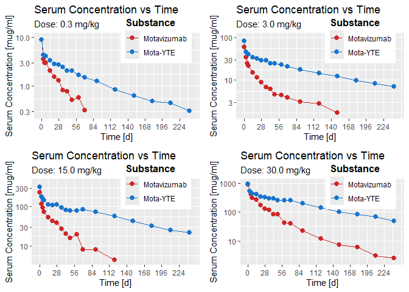
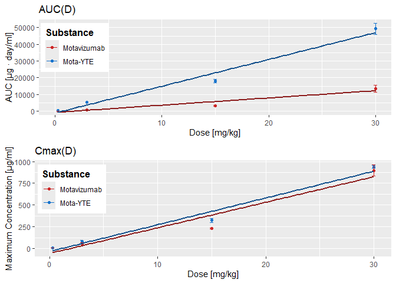

# Praca tydzień 1 - Wykresy
Jan Staszak

## Dane:

    [1] "Dose 0.3"

       Time  MotaC  YTEC
    1     0 8.9000 8.800
    2     3 3.5164 4.303
    3     5 3.0001 4.085
    4     7 3.0001 4.072
    5    14 2.0401 3.309
    6    21 1.5190 2.801
    7    28 1.2960 2.738
    8    35 0.8206 2.420
    9    42 0.7617 2.048
    10   49 0.5171 2.038
    11   60 0.5830 1.681
    12   70 0.3149 1.491
    13   90     NA 1.245
    14  120     NA 0.848
    15  150     NA 0.632
    16  180     NA 0.486
    17  210     NA 0.451
    18  240     NA 0.308

    [1] "Dose 3.0"

       Time  MotaC   YTEC
    1     0 59.300 82.800
    2     3 33.827 45.496
    3     5 24.521 41.041
    4     7 21.465 39.697
    5    14 15.099 33.827
    6    21 11.280 31.598
    7    28  8.740 28.869
    8    35  6.858 28.505
    9    42  6.216 24.482
    10   49  4.557 24.289
    11   60  4.478 22.907
    12   70  3.883 20.404
    13   90  3.056 17.636
    14  120  2.824 14.307
    15  150  1.725 12.191
    16  180     NA  9.657
    17  210     NA  8.164
    18  240     NA  7.068

    [1] "Dose 15.0"

       Time   MotaC    YTEC
    1     0 232.900 324.100
    2     3 115.760 179.841
    3     5  94.226 162.777
    4     7  73.203 146.388
    5    14  53.933 112.999
    6    21  43.060 108.199
    7    28  38.477 112.096
    8    35  27.275  94.834
    9    42  19.838  82.985
    10   49  15.788  79.078
    11   60  19.774  80.491
    12   70   8.062  85.834
    13   90   7.832  74.630
    14  120   4.355  57.793
    15  150      NA  42.579
    16  180      NA  32.188
    17  210      NA  25.330
    18  240      NA  21.603

    [1] "Dose 30.0"

       Time   MotaC    YTEC
    1     0 898.200 938.100
    2     3 534.761 541.016
    3     5 409.491 483.989
    4     7 304.267 431.951
    5    14 264.715 424.997
    6    21 177.599 346.489
    7    28 132.265 326.956
    8    35 118.049 295.223
    9    42  82.578 297.286
    10   49  84.323 256.253
    11   60  43.320 252.141
    12   70  39.756 251.555
    13   90  22.832 204.606
    14  120  12.089 139.516
    15  150   7.443 102.468
    16  180   6.125  83.155
    17  210   3.132  70.686
    18  240   2.560  48.650

    [1] "AUC(D)"

      Dose AUCMota  AUCYTE CVMota CVYTE
    1  0.3    99.5   342.8  0.131 0.078
    2  3.0   850.5  5224.4  0.568 0.042
    3 15.0  3262.1 18022.3  0.268 0.136
    4 30.0 13303.3 49276.6  0.313 0.137

    [1] "Cmax(D)"

      Dose CmaxMota CmaxYTE CVMota CVYTE
    1  0.3      8.9     8.8  0.241 0.162
    2  3.0     59.3    82.8  0.391 0.318
    3 15.0    232.9   324.1  0.043 0.150
    4 30.0    898.2   938.1  0.139 0.036

## Wykresy:

Kod C(t):

``` r
options(scipen=999)

plot0.3<- ggplot()+
  geom_line(data=data0.3, mapping = aes(x=Time, y=MotaC, col='Motavizumab'))+
  geom_line(data=data0.3, mapping= aes(x=Time, y=YTEC, col='Mota-YTE'))+
  geom_point(data=data0.3, mapping = aes(x=Time, y=MotaC, col="Motavizumab"), 
             size=2.5)+
  geom_point(data=data0.3, mapping= aes(x=Time, y=YTEC, col='Mota-YTE'), size=2.5)+
  scale_y_log10()+ coord_cartesian(xlim=c(0,245), ylim = c(0.25,10))+
  labs(title="Serum Concentration vs Time", subtitle = "Dose: 0.3 mg/kg", 
       y="Serum Concentration [mug/ml]", x="Time [d]")+ scale_x_continuous(breaks=seq(0, 245, 28))+
  scale_color_manual(name='Substance', breaks = c("Motavizumab", "Mota-YTE"), 
       values = c("Motavizumab"="firebrick3","Mota-YTE"="dodgerblue3"))+
  theme(legend.title = element_text(size=12, color = "black", face="bold"),
          legend.justification=c(1,0),legend.position=c(0.95, 0.65))

plot3.0<- ggplot()+
  geom_line(data=data3.0, mapping = aes(x=Time, y=MotaC, col='Motavizumab'))+
  geom_line(data=data3.0, mapping= aes(x=Time, y=YTEC, col='Mota-YTE'))+
  geom_point(data=data3.0, mapping = aes(x=Time, y=MotaC, col="Motavizumab"), size=2.5)+
  geom_point(data=data3.0, mapping= aes(x=Time, y=YTEC, col='Mota-YTE'), size=2.5)+
  scale_y_log10()+ coord_cartesian(xlim=c(0,245), ylim = c(1.5,100))+
  labs(title="Serum Concentration vs Time", subtitle = "Dose: 3.0 mg/kg", 
       y="Serum Concentration [mug/ml]", x="Time [d]")+ scale_x_continuous(breaks=seq(0, 245, 28))+
  scale_color_manual(name='Substance', breaks = c("Motavizumab", "Mota-YTE"), 
                     values = c("Motavizumab"="firebrick3","Mota-YTE"="dodgerblue3"))+
  theme(legend.title = element_text(size=12, color = "black", face="bold"),
        legend.justification=c(1,0),legend.position=c(0.95, 0.65))

plot15.0<- ggplot()+
  geom_line(data=data15.0, mapping = aes(x=Time, y=MotaC, col='Motavizumab'))+
  geom_line(data=data15.0, mapping= aes(x=Time, y=YTEC, col='Mota-YTE'))+
  geom_point(data=data15.0, mapping = aes(x=Time, y=MotaC, col="Motavizumab"), size=2.5)+
  geom_point(data=data15.0, mapping= aes(x=Time, y=YTEC, col='Mota-YTE'), size=2.5)+
  scale_y_log10()+ coord_cartesian(xlim=c(0,245), ylim = c(4,400))+
  labs(title="Serum Concentration vs Time", subtitle = "Dose: 15.0 mg/kg", 
       y="Serum Concentration [mug/ml]", x="Time [d]")+ scale_x_continuous(breaks=seq(0, 245, 28))+
  scale_color_manual(name='Substance', breaks = c("Motavizumab", "Mota-YTE"), 
                     values = c("Motavizumab"="firebrick3","Mota-YTE"="dodgerblue3"))+
  theme(legend.title = element_text(size=12, color = "black", face="bold"),
        legend.justification=c(1,0),legend.position=c(0.95, 0.65))

plot30.0<- ggplot()+
  geom_line(data=data30.0, mapping = aes(x=Time, y=MotaC, col='Motavizumab'))+
  geom_line(data=data30.0, mapping= aes(x=Time, y=YTEC, col='Mota-YTE'))+
  geom_point(data=data30.0, mapping = aes(x=Time, y=MotaC, col="Motavizumab"), size=2.5)+
  geom_point(data=data30.0, mapping= aes(x=Time, y=YTEC, col='Mota-YTE'), size=2.5)+
  scale_y_log10()+ coord_cartesian(xlim=c(0,245), ylim = c(2,1000))+
  labs(title="Serum Concentration vs Time", subtitle = "Dose: 30.0 mg/kg", 
       y="Serum Concentration [mug/ml]", x="Time [d]")+ scale_x_continuous(breaks=seq(0, 245, 28))+
  scale_color_manual(name='Substance', breaks = c("Motavizumab", "Mota-YTE"), 
                     values = c("Motavizumab"="firebrick3","Mota-YTE"="dodgerblue3"))+
  theme(legend.title = element_text(size=12, color = "black", face="bold"),
        legend.justification=c(1,0),legend.position=c(0.95, 0.65))
```

Wykresy C(t):

``` r
combined_plot <- plot_grid(plot0.3, plot3.0, plot15.0, plot30.0)
combined_plot
```



Kod AUC(D) i Cmax(D):

``` r
plotAUC<-ggplot()+geom_point(data=dataAUC, mapping = aes(x=Dose, y=AUCMota, col='Motavizumab'))+
  geom_point(data=dataAUC, mapping = aes(x=Dose, y=AUCYTE, col='Mota-YTE'))+
  geom_errorbar(data=dataAUC, aes(Dose, ymin=AUCYTE-CVYTE*AUCYTE*0.5, ymax=AUCYTE+CVYTE*AUCYTE*0.5, col='Mota-YTE'), width=0.3)+
  geom_errorbar(data=dataAUC, aes(Dose, ymin=AUCMota-CVMota*AUCMota*0.5, ymax=AUCMota+CVMota*AUCMota*0.5, col='Motavizumab'), width=0.3)+
  geom_smooth(data=dataAUC,mapping = aes(x=Dose, y=AUCMota), method=lm, se=FALSE, col='firebrick4', size=1)+
  geom_smooth(data=dataAUC,mapping = aes(x=Dose, y=AUCYTE), method=lm, se=FALSE, col='dodgerblue4', size=1)+
  labs(title="AUC(D)", y="AUC [μg · day/ml]", x="Dose [mg/kg]")+
  scale_color_manual(name='Substance', breaks = c("Motavizumab", "Mota-YTE"),values = c("Motavizumab"="firebrick3","Mota-YTE"="dodgerblue3"))+
  theme(legend.title = element_text(size=12, color = "black", face="bold"),
        legend.justification=c(1,0),legend.position=c(0.20, 0.45))+
  coord_cartesian(xlim=c(0,30), ylim = c(0,52500))

plotCmax<-ggplot()+geom_point(data=dataCmax, mapping = aes(x=Dose, y=CmaxMota, col='Motavizumab'))+
  geom_point(data=dataCmax, mapping = aes(x=Dose, y=CmaxYTE, col='Mota-YTE'))+
  geom_errorbar(data=dataCmax, aes(Dose, ymin=CmaxYTE-CVYTE*CmaxYTE*0.5, ymax=CmaxYTE+CVYTE*CmaxYTE*0.5, col='Mota-YTE'), width=0.3)+
  geom_errorbar(data=dataCmax, aes(Dose, ymin=CmaxMota-CVMota*CmaxMota*0.5, ymax=CmaxMota+CVMota*CmaxMota*0.5, col='Motavizumab'), width=0.3)+
  geom_smooth(data=dataCmax,mapping = aes(x=Dose, y=CmaxMota), method=lm, se=FALSE, col='firebrick4', size=1)+
  geom_smooth(data=dataCmax,mapping = aes(x=Dose, y=CmaxYTE), method=lm, se=FALSE, col='dodgerblue4', size=1)+
  labs(title="Cmax(D)", y="Maximum Concentration [μg/ml]", x="Dose [mg/kg]")+
  scale_color_manual(name='Substance', breaks = c("Motavizumab", "Mota-YTE"),values = c("Motavizumab"="firebrick3","Mota-YTE"="dodgerblue3"))+
  theme(legend.title = element_text(size=12, color = "black", face="bold"),
        legend.justification=c(1,0),legend.position=c(0.20, 0.45))
```

Wykresy AUC(D) i Cmax(D):


