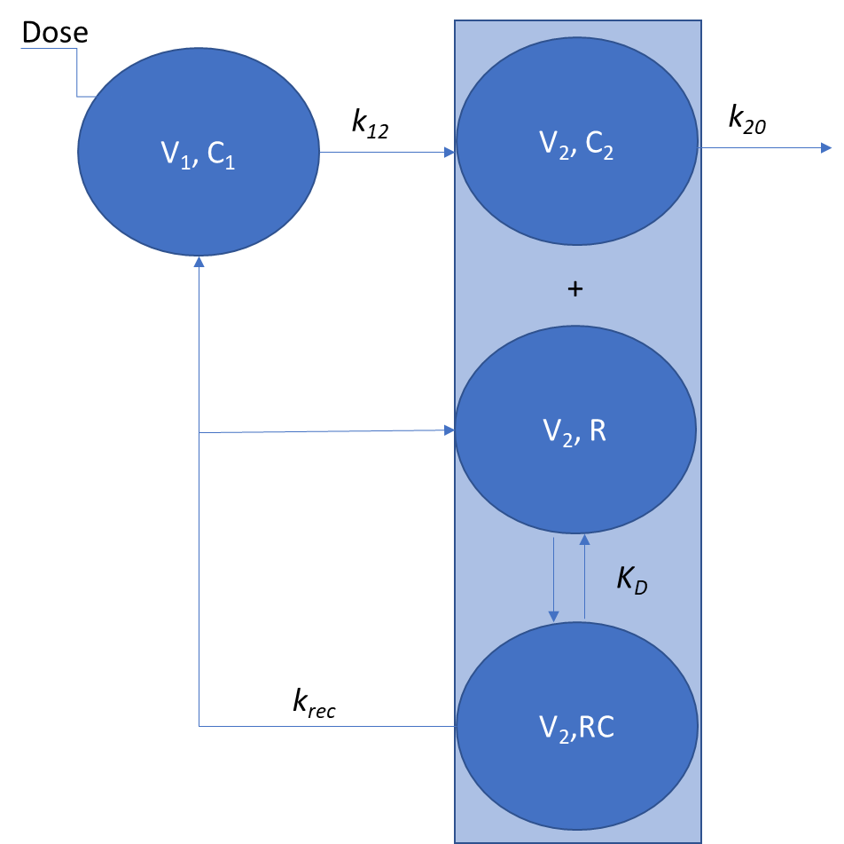

# Setup

```{r setup, include=FALSE}
knitr::opts_chunk$set(cache=FALSE, message=FALSE, error=FALSE, warning=FALSE, comment=NA, out.width='95%')
```

```{r packages, message=FALSE}
library(mrgsolve)
library(dplyr)
library(ggplot2)
# select<-dplyr::select
# filter<-dplyr::filter
set.seed(10271998) 
```

# Introductions

Here we propose a mechanistic model of Motawizumab that includes FcRn recycling. It is a two-compartment pharmacokinetic system with nonlinear receptor-mediated recycling.

{width="445"}

$$
\begin{align}
\frac{dA_1}{dt} &= -k_{12} \cdot A_1 + k_{rec} \cdot RC \cdot V_{2}, A_1(0)=Dose  \\
\frac{dC_2}{dt} &= - k_{on}\cdot C_2 \cdot R  + k_{off} \cdot RC + k_{12} \cdot A_1/V_2 -  k_{20} \cdot C_2, C_2(0)=0 \\
\frac{dR}{dt} &= - k_{on} \cdot C_2 \cdot R + k_{off} \cdot RC + k_{rec} \cdot RC, R(0)=R_0  \\
\frac{dRC}{dt} &=  k_{on} \cdot C_2 \cdot R - k_{off} \cdot RC - k_{rec} \cdot RC, RC(0)=0  \\
\end{align}
$$

where:

-   $C1$: Drug concentration in central compartment
-   $A1$: Drug mass in central compartment
-   $C2$: Drug concentration in peripheral compartment 
-   $R$: Receptor concentration 
-   $RC$: Drug-receptor complex concentration 
-   $V1$: Volume of central compartment 
-   $V2$: Volume of peripheral compartment 
-   $K_{12}$: First-order transfer rate constant 
-   $K_{20}$: Elimination rate constant 
-   $K_{rec}$: Recycling rate constant 
-   $K_D$: Dissociation constant 
-   $R_0$: Baseline receptor concentration
-   $A2$: Drug mass in peripheral compartment 
-   $AR$: Receptor mass 
-   $ARC$: Drug-receptor complex mass 

The concentration in central compartment is
$$
C_1 = \frac{A_1}{V_1}
$$

## Mrgsolve code
```{r}
code1 <- '
#
$PARAM V1=0.046, K20=0.023, K12=0.13, KREC=0.34, KD=8352, AR0=724, KON=10000

$CMT A1 A2 AR ARC

$MAIN

double KOFF = KON*KD;
AR_0 = AR0;

$ODE
dxdt_A1 = -K12*A1 + KREC*ARC;
dxdt_A2 = -KON*A2*AR + KOFF*ARC + K12*A1 - K20*A2;
dxdt_AR = -KON*A2*AR + KOFF*ARC + KREC*ARC;
dxdt_ARC=  KON*A2*AR - KOFF*ARC - KREC*ARC;

$TABLE
double C1=A1/V1;
$capture C1;
'
```


# Approximation

This first approximation assumes quasi steady-state binding equilibrium. In this approximation it is assumed that the following equality holds:

$$
K_D = \frac{R \cdot C_2}{RC}
$$
By Introducing new variables (total receptor and drug concentrations)

$$
Rtot = RC+R \\
Ctot = RC+C_2
$$
one can recognize that the above set of equations can be expressed as:

$$
\begin{align}
\frac{dA_1}{dt} &= -k_{12} \cdot A_1 + k_{rec} \cdot RC \cdot V_{2}, A_1(0)=Dose  \\
\frac{dC_{tot}}{dt} &= k_{12} \cdot A_1/V_2 -  k_{20} \cdot C_2 - k_{rec} \cdot RC, C_2(0)=0 \\
\frac{dR_{tot}}{dt} &= 0, R(0)=R_0  \\
RC &= \frac{R_{tot} \cdot C_2}{K_D+C_2}
\end{align}
$$

where C2 is given by solving the quadratic equation:

$$
\begin{align}
X &= C_{tot} - R_0 - K_D \\
C_2 &= \frac{1}{2} \left( X + \sqrt{X^2 + 4 \cdot K_D \cdot C_{tot}} \right)
\end{align}
$$
Converting to masses leads to:

$$
\begin{align}
\frac{dA_1}{dt} &= -k_{12}  \cdot A_1 + \frac{k_{rec} \cdot AR_0 \cdot A_2}{K'_D + A_2} \\
\frac{dA_{tot}}{dt} &= k_{12} \cdot A_1 - \frac{k_{rec} \cdot AR_0 \cdot A_2}{K'_D + A_2} - k_{20} \cdot A_2 \\
\end{align}
$$
where:

$$
\begin{align}
X &= A_{tot} - AR_0 - K'_D \\
A_2 &= \frac{1}{2} \cdot \left( X + \sqrt{X^2 + 4 \cdot K'_D \cdot A_{tot}} \right) \\
AR_0 &= R_0 \cdot V_2 \\
A_{tot} &= R_{tot}\cdot V_2 \\
K'_{D} &= K_{D}\cdot V_2 \\
\end{align}
$$

## Mrgsolve code

```{r qe-tmdd}
code2 <- '
#
$PARAM V1=0.046, K20=0.023, K12=0.13, KREC=0.34, KD=8352, AR0=724

$CMT A1 Atot

$MAIN

$ODE
double XYZ = Atot - AR0 - KD;
double disc = XYZ*XYZ + 4.0*KD*Atot;
double A2 = 0.5*(XYZ + sqrt(disc));

dxdt_A1 = -K12*A1 + KREC*AR0*A2/(KD + A2);
dxdt_Atot =  K12*A1 - KREC*AR0*A2/(KD + A2) - K20*A2;

$TABLE
double C1=A1/V1;
$capture C1 A2;
'
```

# Reduced model

The above model can be further reduced to a linear two-compartment model. This model is obtained by applying the linear-binding (unsaturated) approximation ($A_2$<<$K'_D$). Under this condition the saturable term linearizes as

$$
\frac{AR_0 \cdot A_2}{K'_D + A_2}=\frac{AR_0 \cdot A_2}{K'_D}
$$
The total-drug mass balance also linearizes

$$
A_{tot} = A_2 + AR \approx A_2 + \frac{AR_0}{K'_D} \cdot A_2 = A_2 \cdot \Bigl(1 + \frac{AR_0}{K'_D}\Bigr)
$$
  
which leads to
$$
\begin{align}
\frac{dA_1}{dt} &= -k_{12} \cdot A_1 + k_{21} \cdot A_{tot} \\
\frac{dA_{tot}}{dt} &= k_{12} \cdot A_1 - (k_{21} + k_{el})\cdot A_{tot}
\end{align}
$$
where:

$$
\begin{align}
\alpha &= 1 + \frac{AR_0}{K'_D} \\
k_{\mathrm{rec}} &= \frac{k_{rec} \cdot AR_0}{K'_D} \\
k_{21} &= \frac{k_{rec}}{\alpha} \\
k_{\mathrm{el}} &= \frac{k_{20}}{\alpha}
\end{align}
$$

$$
\begin{align}
C_1 &= \frac{A_1}{V_1} \\
A_2 &= \frac{A_{tot}}{\alpha}
\end{align}
$$

## Mrgoslve code

```{r qe-reduced}
code3 <- '
#
$PARAM V=0.046, K20=0.023, K12=0.13, KREC=0.34, KD=8352, AR0=724

$CMT A1 Atot

$MAIN
double alpha = 1.0 + AR0 / KD;          // scaling factor
double k_rec = KREC * AR0 / KD;         // effective recycling rate
double k21   = k_rec / alpha;           // return rate to central 
double kel   = K20   / alpha;           // effective elimination from Atot
  
$ODE
dxdt_A1 = -K12 * A1 + k21 * Atot;
dxdt_Atot =  K12 * A1 - (k21 + kel) * Atot;

$TABLE

double C1  = A1 / V;   
double A2 = Atot / alpha;

$capture C1 A2;
'
```

# Simulations

Predictions are nicely overlaid proving the approximations are correct. The last model is equivalent to a 2-compartment model with elimination from peripheral compartment.

```{r plot-and-compare}
s
mod1 <- mcode("d1", code1)
mod2 <- mcode("d2", code2)
mod3 <- mcode("d3", code3)

out1 <- mod1 %>%
  ev(amt = 15) %>%
  mrgsim(end = 250, delta = 0.1)%>%
  as.data.frame() %>% mutate(model = "Full")%>%
  select(c(ID,time, C1,A2,model))
out2 <- mod2 %>%
  ev(amt = 15) %>%
  mrgsim(end = 250, delta = 0.1)%>%
  as.data.frame() %>% mutate(model = "QE")%>%
  select(c(ID,time, C1,A2,model))
out3 <- mod3 %>%
  ev(amt = 15) %>%
  mrgsim(end = 250, delta = 0.1)%>%
  as.data.frame() %>% mutate(model = "Reduced")%>%
  select(c(ID,time, C1,A2,model))

out <- bind_rows(out1,out2, out3)

p1 <- ggplot(out, aes(time, C1, color = model)) +
  geom_line(size = 1) +
  ggtitle("C1 vs time: QE vs Reduced")

p2 <- ggplot(out, aes(time, A2, color = model)) +
  geom_line(size = 1) +
  ggtitle("A2 vs time: QE vs Reduced")

print(p1)
print(p2)
```


# Session info

```{r}
sessionInfo()
```
